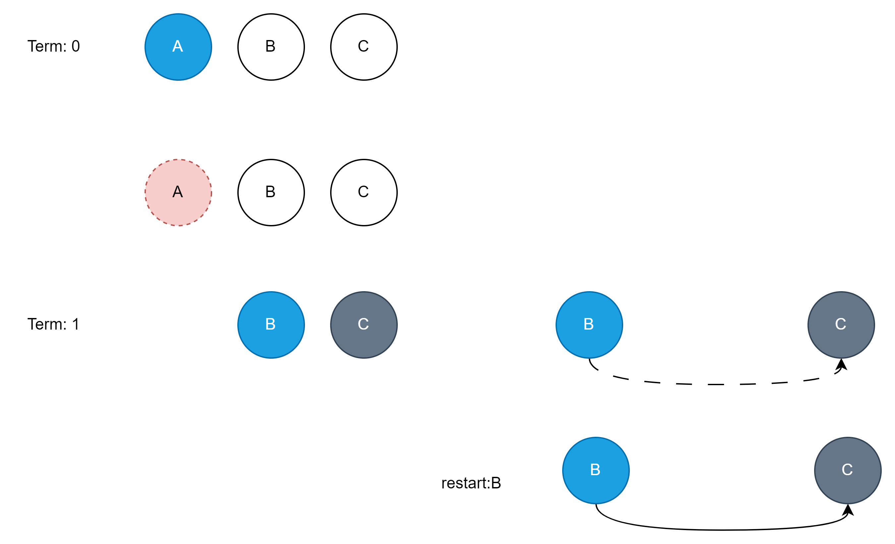
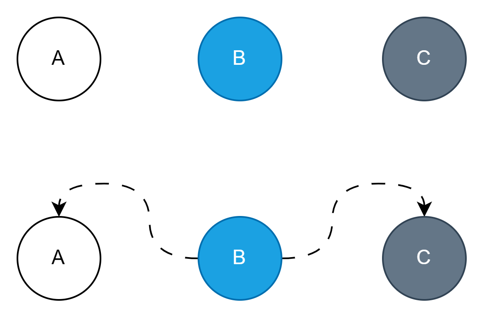

# 概述

本文档记录在Raft共识实现中遇到各种问题

在本文档中对问题的描述中如出现图表信息，其中的颜色标准及其所代表的含义如下

## Raft共识所有节点连接正常，但是不出块

### 特征：

1. leader的选票收到的选票都被认为是旧的选票（选票基于的任期落后）；
2. Candidate收到了leader的block但因其状态为leader changing拒绝；
3. 重启所有节点可以恢复正常。

### 分析：

针对特征1：有理由怀疑发出旧选票的节点，没有正确的处理最近一次新Leader的信息。

针对特征2，3: 节点重启后，状态会被置为Follower，此时能够正常接受区块，所以共识恢复正常。

如图中 Term1 中B当选了新的Leader，但当选信息并未正确发送到节点C，由于后续并没有`NewLeader`信息的重复发送，所以C永远无法通过`NewLeader`信息更新Leader信息。此时网络不满足活性要求，就无法再出块了。

一旦出现了上述状态：除非重启所有节点，否则无法恢复共识。符合特征3。

如果此时C重连：仍然无法解决问题，因为B往C发区块时，B会认为C已经拥有该区块，所以C在一段时间后也会进入Candidate状态

如果只重启B：由于A,C已经处理Candidate所以B发的区块A,C不会接受。

只重启A：未验证这种情况，按道理是可以恢复网络，前提是B还是Leader，但逻辑上是如果B收到了合法的选票后，为了能够争取成为下一任Leader，B也会进入Candidate状态。

## 解决办法

#### 方案1：

在新的Leader当选后，用Gossip的方式对`NewLeader`广播，这样即使B，C未连接，C也会通过A收到`NewLeader`；

优点：代码涉及面少，只对消息进行了冗余发送，不改变原有逻辑

缺点：

1. 消息冗余

#### 方案2：

Candidata阶段的节点仍然可以对区块签名。

风险：改变了原有逻辑，可能会出现其他问题。

