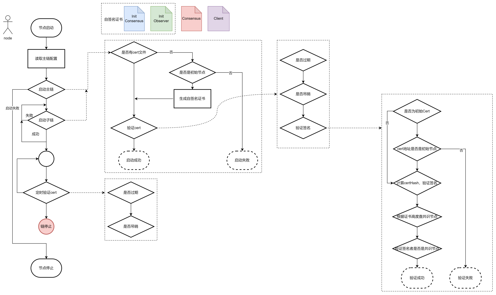
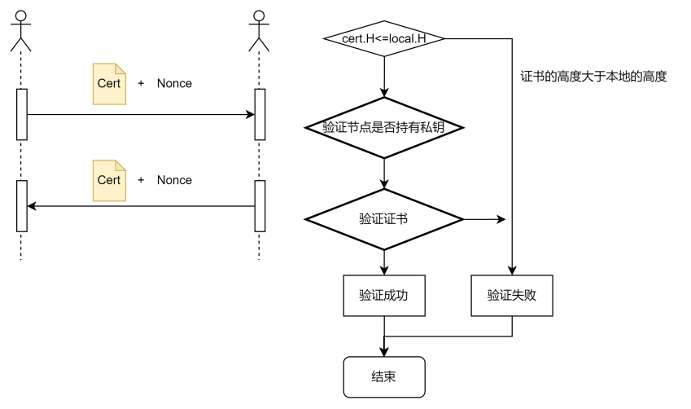
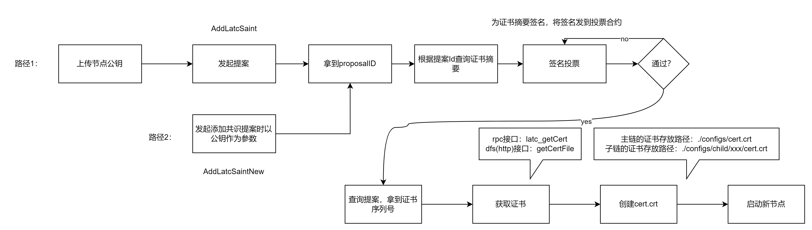
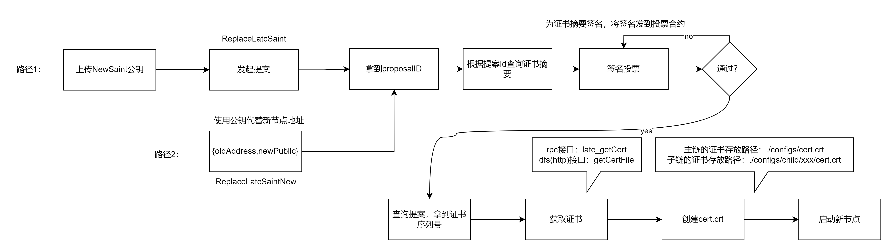
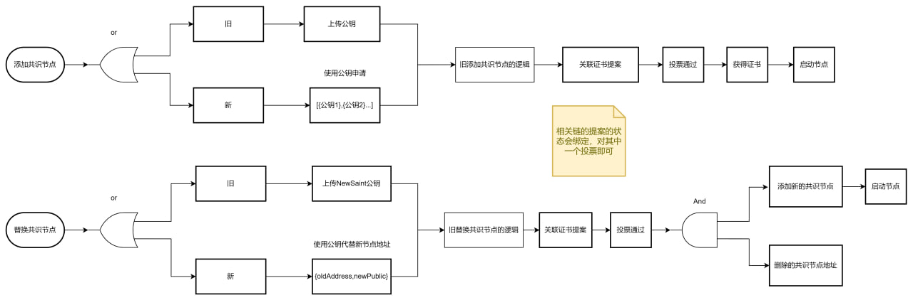
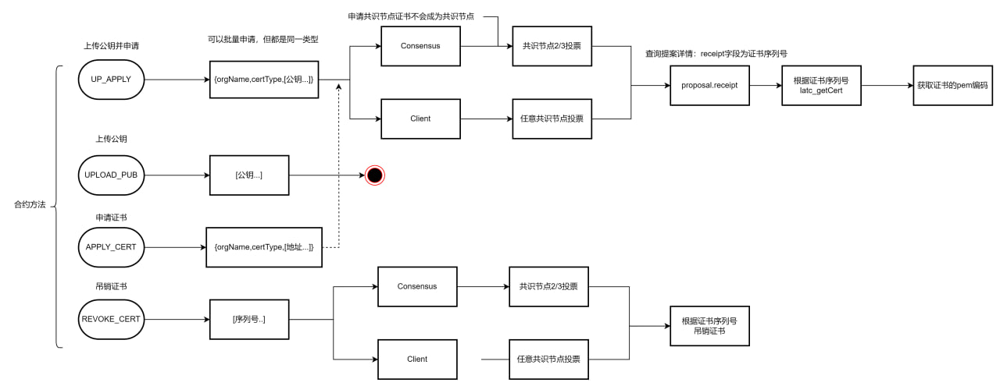
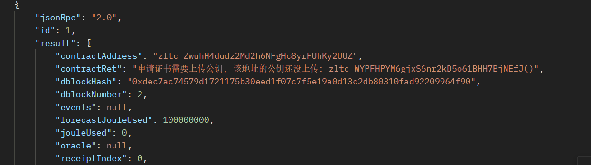
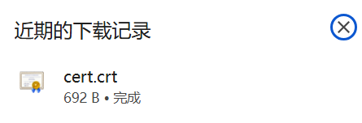

# 节点证书

## 需求分析：

​	 控制联盟链中普通节点的接入和退出。能够控制节点访问且不依赖于第三方CA。

1. 任一想要加入联盟的节点必须经过联盟内成员的同意。申请
1. 联盟管理员可以决定（或共同决定）踢出某个节点。吊销

## 总体设计

1. 为每个节点颁发一个证书，证书类型分为4类
   1. InitConsensus： 创世区块中指定的共识节点，自签名
   2. InitClient：创世区块中指定的观察节点（见证节点），自签名。memeberGroup: 1,0
   3. Consensus：通过提案添加的共识节点证书
   4. Client：通过提案申请的客户端证书、或共识节点直接颁发（不走合约）的证书。
2. 在三处会对证书进行验证
   1. 节点启动时，验证证书合法性；
   2. 节点运行时，定期验证书状态；吊销
   3. 节点间握手时，互相校验彼此的证书。

3. 颁布证书的方式有三种：
   1. 添加共识节点、替换共识节点时（链配置更改合约）；[A,B,C,D]; E `consensus`,  D->E; 1把D吊销，E
   2. 向`节点证书合约`发起申请；`client`  任一共识节点签名后即可
   3. 节点用自己的私钥签名生成证书（但只有共识节点生成的证书才能通过验证，握手的时候校验）。

4. 吊销证书的方式有三种
   1. 删除共识节点，替换共识节点。
   2. 向`节点证书合约`发起吊销申请。
   3. 节点单方面吊销某个证书。

## 详细设计

### 新增合约

新增合约以及新增的合约方法

| 合约地址                                                     | 新增方法            | 方法描述             |
| ------------------------------------------------------------ | ------------------- | -------------------- |
| [zltc_QLbz7JHxYJDL9LAguz9rKrwNtmfY2UoAZ](#desginNodeCert) 节点证书合约 | apply               | 申请证书             |
|                                                              | revoke              | 申请吊销证书         |
|                                                              | uploadKey           | 上传公钥             |
|                                                              | upAndApply          | 上传公钥并申请证书   |
| [zltc_ZwuhH4dudz2Md2h6NFgHc8yrFUhKy2UUZ]()链配置更改合约     | addLatcSaintNew     | 通过公钥添加共识节点 |
|                                                              | replaceLatcSaintNew | 通过公钥替换共识节点 |
| [zltc_amgWuhifLRUoZc3GSbv9wUUz6YUfTuWy5]()提案投票合约       | signVote            | 签名投票             |

### 关于证书类型

1. `InitConsensus`： 创世区块配置文件genesis.json中配置了共识节点信息，`latcSaints`，根据此配置信息即指定了哪些节点拥有`InitConsensus`证书
2. `InitClient`: genesis.json中增加了配置项`observers`类型与 `latcSaint`一致，带配置项指定了哪些节点拥有`InitClient`证书
3. `Consensus`: 获取该类型的证书的途径由两种，a. 通过添加共识节点和替换共识节点; ~~b. 向 节点证书合约 发起申请~~。方法b在节点证书合约的介绍中会做详细说明。
4. `Client`: 获取该类型的证书有两种途径：a.通过向 节点证书合约 发起申请，由共识节点进行签名投票。b. 共识节点通过latc_publishCert直接发布证书。关于**签名投票**和**发布证书**分别会在**节点证书合约**和**新增接口**中详细说明

### 证书验证

1. 节点启动

   

2. 节点握手

   

### 共识节点操作


### 1.添加共识节点

途径1： 先上传新的共识节点的公钥到节点证书合约（点击跳转[上传公钥的接口](#apiUploadPubKey)），然后执行后续加共识节点的逻辑

途径2：通过合约新方法：AddLatcSaintCodeNew，该方法要求申请时将公钥作为参数（之前是以地址作为参数）。

>[签名投票](#apiSignVote)
>
>[获取证书](#apiGetCert)
>
>[获取证书文件（下载）](#apiGetCertFile)



#### 2. 删除共识节点

删除共识节点的逻辑和接口没有变化

#### 3. 替换共识节点



#### 4.提案结构:

如下为添加共识节点的提案内容示例，nodeCertProposal字段为生成证书的提案。==**<u>为proposalId或nodeCertProposal投票皆可。</u>**==

```json
{
            "proposalId": "0x03000000007323431313139",
            "proposalState": 1,
            "nonce": 0,
            "launcher": "xxx",
            "createAt": 12312312,
            "modifiedAt": 12312312,
            "txHash": "xxx",
            "dbNumber": 0,
            "modifyType": 2,
            "configValue": [
                "xxxx"
            ],
            "nodeCertProposal": "0x05000000030323431313139"
        }
```
投票通过, 通过后分别查看两个提案的内容如下：

a. 链配置更改提案, receipt字段为证书序列号列表（批量添加时会有多个序列号返回）

```json
{
            "proposalId": "0x03000000003230323431313139",
            "proposalState": 2,
            "nonce": 0,
            "receipt": "[\"117521\"]",
            "launcher": "xxx",
            "createAt": 1732004792,
            "modifiedAt": 1732005008,
            "txHash": "xxx",
            "dbNumber": 277,
            "modifyType": 2,
            "configValue": [
                "xxx"
            ],
            "nodeCertProposal": "0x05000000003230323431313139"
}
```
b. 节点证书提案。receipt字段为证书序列号列表（批量添加时会有多个序列号返回）

```json
{
            "proposalId": "0x05000000003230323431313139",
            "proposalState": 2,
            "nonce": 2,
            "receipt": "[\"117521\"]",
            "launcher": "xxx",
            "createAt": 1732004792,
            "modifiedAt": 1732005008,
            "txHash": "xxx",
            "dbNumber": 276,
            "applyType": "Apply",
            "certType": "Consensus",
            "orgName": "zkjg.cn",
            "nodeCertParam": [
                {
                    "address": "zltc_Xmk6g2Lgxitrx4xEPUZgF4hHdnHwDcBuU",
                    "serialNumber": 0,
                    "certDigest": "xxx",
                    "signs": "xxx"
                }
            ],
            "configModifyProposal": "0x03000000003230323431313139"
        }
```

####  总结

如下图，旧表示之前发起相关提案的接口，新表示使用公钥替换地址作为参数的接口；



### 节点证书合约<span id="desginNodeCert"></span>

节点证书合约为新增合约，合约地址为：zltc_QLbz7JHxYJDL9LAguz9rKrwNtmfY2UoAZ；合约[ABI](http://192.168.1.185:8000/contract/precompile/contractsTable.html#nodecertcontract)：

该合约提供了四个方法：上传公钥`UPLOAD_PUB`申请证书`APPLY_CERT`吊销证书`REVOKE_CERT`上传公钥并申请证书`UP_APPLY`。

> 1. 要申请证书，公钥是必须要上传的，UP_APPLY 方法将上传公钥和申请证书放在一个步骤中。
> 2. 公钥只需要上传一次： 如节点A申请了一个证书过期了，现要再申请一次，可以直接通过APPLY_CERT方法申请。
> 3. 在申请证书之后，提案详细中会返回证书摘要信息，”审核员“对该概要进行签名投票；
> 4. 证书的过期时间为1年，暂不支持指定

#### 节点证书提案结构

| 字段名               | 类型   | 描述                                                         |
| -------------------- | ------ | ------------------------------------------------------------ |
| applyType            | string | 申请类型，apply/revoke                                       |
| certType             | string | 证书类型                                                     |
| orgName              | string | 组织名，预留                                                 |
| nodeCertParam        | []list | {<br/> "address": "申请人地址 address",<br/> "serialNumber": 序列号,<br/> "certDigest":  "证书摘要，字符串类型  base64"<br/>"signs": "签名，字符串类型 base64"<br/>} |
| configModifyProposal | string | 相关链的链配置已更改提案ID                                   |




### 签名投票

在此之前，针对提案的投票，需要有权限的账户构造一笔交易（交易中包含提案ID以及统一或反对）发送到投票合约。在生成证书的过程中需要有权限的用户对证书内容进行签名来授权给证书合法性，这个过程需要有权限的用户针对特定内容在合约以外（安全性由用户自己控制）用自己的私钥对证书内容签名。

此时，签名投票需要账户构造一笔交易（交易中包含：提案ID，签名信息，签名者）发送到投票合约signVote方法（详情见[投票预置合约ABI](http://192.168.1.185:8000/contract/precompile/contractsTable.html#proposalvote)）

>支持签名投票的提案有：
>
>1. 添加/更改共识节点提案（大类为配置修改提案）
>2. 申请证书提案（大类为节点证书提案）

### 异常情况

上述需要申请证书的功能中，由于证书需要公钥，所以在申请之前必须保证账户公钥已经上传到链上，或使用新方法用公钥代替地址。

在缺失公钥时会报如下错误：



## 新增接口

### wallet_getAddLatcSaintCodeNew

### 获取添加共识节点的code

参数：[]Param

Param:

|         |                |             |
| ------- | -------------- | ----------- |
| Address | 节点地址       |             |
| Pwd     | 节点账户的密码 | 用于读取key |

> 地址对应的fileKey需要在data/accountKey目录下

示例：

```json
{
    "jsonrpc": "2.0",
    "method": "wallet_getAddLatcSaintCodeNew",
    "params": [
       [
        {
            "Address": "zltc_Xmk6g2Lgxitrx4xEPUZgF4hHdnHwDcBuU",
            "Pwd": "{{password}}"
        }
       ]
    ],
    "id": 481
}
```

返回值为16进制code

### wallet_getReplaceLatcSaintCodeNew

### 获取添加替换节点的code

参数：[]replaceSaint, pwd

<table>
  <tr>
    <th></th>
    <th></th>
    <th></th>
  </tr>
  <tr>
    <td rowspan="2">JsonObject</td>
    <td colspan="1">oldSaint</td>
    <td colspan="1">旧共识节点证书</td>
  </tr>
  <tr>
    <td colspan="1">newSaint</td>
    <td colspan="1">新共识节点地址</td>
  </tr>
   <tr>
    <td colspan="1">新共识节点地址的密码</td>
  </tr>
</table>

示例：

  ```json
  {
      "jsonrpc": "2.0",
      "method": "wallet_getReplaceLatcSaintCodeNew",
      "params": [
         {
           "oldSaint": "zltc_g2L1GFdBZW6wHRBs1uZNDWeHjvMErzwri",
           "newSaint": "zltc_QkgkBgN25yAG2V1jTtFoawGSPg6yHcvRb"
         },
         "{{password}}"
      ],
      "id": 481
  }
  ```

返回值为16进制code

### wallet_getSignVote <span id="apiSignVote"></span>

### 获取签名投票的code

参数：

- proposalId 提案ID
- pwd 投票人的账户密码

示例：

```json
{
    "jsonrpc": "2.0",
    "method": "wallet_getSignVote",
    "params": [
        "0x050000000070726f706f73616c5f6164647265737300000000000000003230323431313138", //certDisgest
        "{{password}}" // 节点密码
    ],
    "id": 481
}
```

返回：code

### wallet_getApplyNodeCertCode

### 获取申请节点证书的code

参数：

|          |          |                  |
| -------- | -------- | ---------------- |
| certType | 证书类型 |                  |
| orgName  | 组织名   | 预留，选填       |
| applies  | address  | 申请者的账户地址 |

参数：

```json
      {
          "jsonrpc": "2.0",
          "method": "wallet_getApplyNodeCertCode",
          "params": [
              {
                 "certType": 0,
                 "orgName": "",
                 "applies": [
                  {
                       "address": "{{account}}"
                  }
                 ]
              }
          ],
          "id": 485
      }```
```

返回：code

### wallet_getRevokeNodeCertCode

### 获取吊销节点证书的code

参数：

- []serialNumber

示例：

   ```json
   {
       "jsonrpc": "2.0",
       "method": "wallet_getRevokeNodeCertCode",
       "params": [
        [64910389297,3869,289799096046914671177019247265221074243]
       ],
       "id": 485
   }
   ```

返回：code

### wallet_getUploadPubkeyCode

### 获取上传公钥的code<span id="apiUploadPubKey"></span>>

参数：

- address  申请者账户地址
- pwd 密码

> 此方法要求 address的fileKey在节点的data/account目录下

示例：

```json
{
    "jsonrpc": "2.0",
    "method": "wallet_getUploadPubkeyCode",
    "params": [
        "zltc_Xmk6g2Lgxitrx4xEPUZgF4hHdnHwDcBuU",
        "password"
    ],
    "id": 485
}
```

返回：code

### wallet_getUpAndApplyCode 获取上传公钥并申请证书的code

参数：

- address
- pwd

> 此方法要求 address的fileKey在节点的data/account目录下

示例

```json
{
    "jsonrpc": "2.0",
    "method": "wallet_getUpAndApplyCode",
    "params": [
        "zltc_Xmk6g2Lgxitrx4xEPUZgF4hHdnHwDcBuU",
        "",
        "password"
    ],
    "id": 485
}
```

返回：code

###  latc_publishCert

### 发布证书

(发布完成后只能在当前节点查询到，但其他节点不影响验证)

参数：

- []公钥列表：需要颁发的节点的公钥
- 当前节点的账户密码

参数示例：

```json
{
    "jsonrpc": "2.0",
    "method": "latc_publishCert",
    "params": [
        [
        "-----BEGIN PUBLIC KEY-----\nMFkwEwYHKoZIzj0CAQYIKoEcz1UBgi0DQgAEhkFnGizi/sHmX4hPAfK70Bjg1Wos\nfu+PPATJ3bOL7hL8pI2sqaxovu7AGP34yOCyzmCY8Myxr7Ktlpg3dNUhGQ==\n-----END PUBLIC KEY-----"
        ],
        "{{password}}"
    ],
    "id": 485
}
```

返回值：证书序列号

```json
{
    "jsonRpc": "2.0",
    "id": 485,
    "result": [
        "123421523565",
        "493734294370"
    ]
}
```

### latc_revokeCert

### 吊销证书

(只在当前节点生效，在其他节点验证时非吊销状态)

参数: 节点密码

- []serialNumber, 序列化数组
- pwd, 当前节点的账户密码

参数示例

```json
{
             "jsonrpc": "2.0",
             "method": "wallet_revokeCert",
             "params": [
                 [
                 {
                     "serialNumber": 154
                 }
                 ],
                 "123456"
             ],
             "id": 485
}
```

返回值：吊销成功的证书序列号

```json
{
    "jsonRpc": "2.0",
    "id": 485,
    "result": [
        "247422"
    ]
}
```

### latc_checkCert

### 检查证书状态

参数

- 证书序列号

```
{
    "jsonrpc": "2.0",
    "method": "latc_checkCert",
    "params": [
        "247422"
    ],
    "id": 485
}
```

返回值:

- error:
   - serialNumber is not a number:  输入参数有误
   - notExist：证书在本节点不存在
- success
   - revoked： 证书被吊销
   - valid：有效

```json
{
    "jsonRpc": "2.0",
    "id": 485,
    "error": {
        "code": -32000,
        "message": "no this cert"
    }
}
```

```json
{
    "jsonRpc": "2.0",
    "id": 485,
    "result": "revoked"
}
```

### latc_getCert<span id="apiGetCert"></span>

### 获取证书

参数：

- 证书序列号

```json
{
    "jsonrpc": "2.0",
    "method": "latc_getCert",
    "params": [
        "3279"
    ],
    "id": 485
}
```

返回值

- error
   - serialNumber is not a number:  输入参数有误
   - notExist：证书在本节点不存在
- success
   - 证书的pem格式

```
{
    "jsonRpc": "2.0",
    "id": 485,
    "result": "-----BEGIN CERTIFICATE-----\nMIIBpDCCATCgAwIBAgICDl8wCgYIKoEcz1UBg3UwSzFJMAkGA1UEBxMCMTUwDQYD\nVQQHEwZDbGllbnQwLQYDVQQHDCZ6bHRjX1htazZnMkxneGl0cng0eEVQVVpnRjRo\nSGRuSHdEY0J1VTAgFw0yNDExMTgwNzA5NTlaGA8yMTI0MTAyNTA3MDk1OVowSzFJ\nMAkGA1UEBxMCMTUwDQYDVQQHEwZDbGllbnQwLQYDVQQHDCZ6bHRjX1htazZnMkxn\neGl0cng0eEVQVVpnRjRoSGRuSHdEY0J1VTBZMBMGByqGSM49AgEGCCqBHM9VAYIt\nA0IABJPGUdYm5fJl3MI9MBZirrNaojTd4OkVcUahMTddewhNwOa3LtgBEjcxYdxO\n4YUXYMaTY3rhoCYbT4Zf/K2SwfmjAjAAMAoGCCqBHM9VAYN1A2IANmMlKLXz2mAt\n3JSTY1WZvLriY+xoKanwLQkWagfwTSZvXa+Kcf8qZ2+MNgiosfJN58t+y7wQ7yrp\nI8DfesmM6gGG1kVK7fBLvZ+Zu5yrrHme9nkV7Z1xm6zVBroD1qrb1Q==\n-----END CERTIFICATE-----\n"
}
```

### /getCertFile <span id="apiGetCertFile"></span>

### 下载证书文件

DFS 接口

| 方法名      | 请求类型 | 参数         |
| ----------- | -------- | ------------ |
| getCertFile | Get      | serialNumber |

示例：



