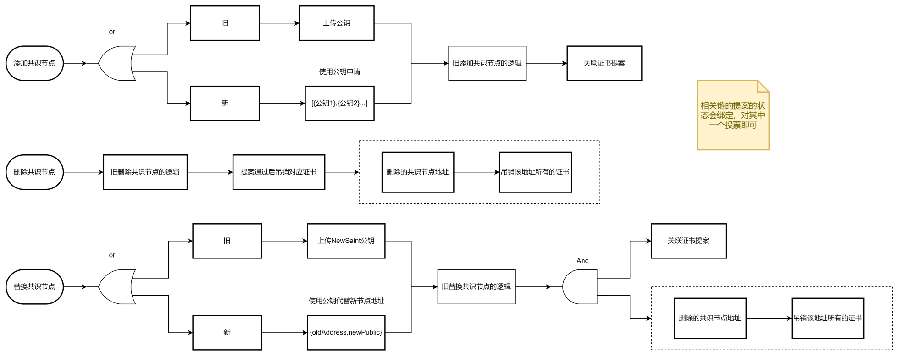
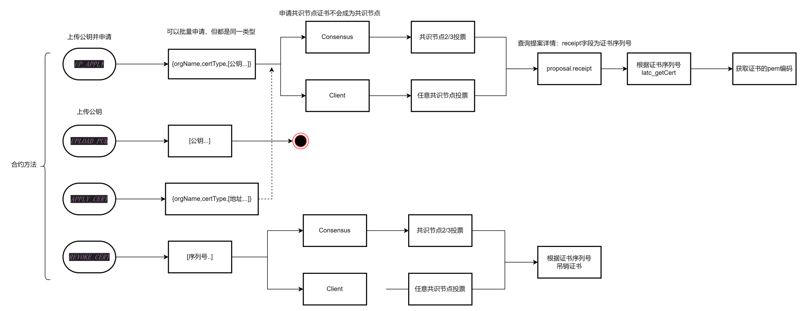

# 节点证书

## 需求分析：

​	 控制联盟链中普通节点的接入和退出。能够控制节点访问且不依赖于第三方CA。

1. 任一想要加入联盟的节点必须经过联盟内成员的同意。
1. 联盟管理员可以决定（或共同决定）踢出某个节点。

## 总体设计

1. 为每个节点颁发一个证书，证书类型分为4类
   1. InitConsensus： 创世区块中指定的共识节点
   2. InitClient：创世区块中指定的观察节点
   3. Consensus：通过提案添加的共识节点证书
   4. Client：通过提案申请的客户端证书或共识节点直接颁发（不走合约）的证书
2. 在三处会对证书进行验证
   1. 节点启动时，验证证书合法性；
   2. 节点运行时，定期验证书状态；
   3. 节点间握手时，互相校验彼此的证书。

3. 颁布证书的方式有三种：
   1. 添加共识节点、替换共识节点时；
   2. 向节点证书合约发起申请；
   3. 节点用自己的私钥签名生成证书（但只有共识节点生成的证书才能通过验证）。

4. 吊销证书的方式有三种
   1. 删除共识节点。
   2. 向节点证书合约发起吊销申请；
   3. 节点单方面吊销某个整数


## 详细设计

1. 关于证书类型
   1. `InitConsensus`： 创世区块配置文件genesis.json中配置了共识节点信息，根据此配置信息即指定了哪些节点拥有`InitConsensus`证书
   2. `InitClient`: genesis.json中增加了配置项`observers`类型与 `latcSaint`一致，带配置项指定了哪些节点拥有`InitClient`证书
   3. `Consensus`: 获取该类型的证书的途径由两种，a. 通过添加共识节点和替换共识节点;b. 向节点证书合约发起申请。方法b在节点证书合约的介绍中会做详细说明。
   4. `Client`: 获取该类型的证书有两种途径：a.通过向节点证书合约发起申请，由共识节点进行签名投票。b. 共识节点通过latc_publishCert直接发布证书。关于**签名投票**和**发布证书**分别会在**节点证书合约**和**新增接口**中详细说明

2. 证书验证

   1. 节点启动

      

   2. 节点握手

      

3. 共识节点操作

   在引入了节点证书体系后，对共识节点的操作有一下变化

   需要注意的是，在节点被成功加入共识后，节点证书需要手动获取并创建"cert.crt"文件放在节点的config目录下。

   

4. 节点证书合约

   节点证书合约为新增合约，合约地址为：zltc_QLbz7JHxYJDL9LAguz9rKrwNtmfY2UoAZ；合约[ABI](http://192.168.1.185:8000/contract/precompile/contractsTable.html#nodecertcontract)：

   该合约提供了四个方法：上传公钥`UPLOAD_PUB`申请证书`APPLY_CERT`吊销证书`REVOKE_CERT`上传公钥并申请证书`UP_APPLY`。

   > 1. 要申请证书，公钥是必须要上传的，UP_APPLY 方法将上传公钥和申请证书放在一个步骤中。
   > 2. 公钥只需要上传一次： 如节点A申请了一个证书过期了，现要再申请一次，可以直接通过APPLY_CERT方法申请。
   > 3. 在申请证书之后，提案详细中会返回证书摘要信息，”审核员“对该概要进行签名投票；
   > 4. 证书的过期时间为1年，暂不支持指定

   

5. 签名投票

   在此之前，针对提案的投票，需要有权限的账户构造一笔交易（交易中包含提案ID以及统一或反对）发送到投票合约。在生成证书的过程中需要有权限的用户对证书内容进行签名来授权给证书合法性，这个过程需要有权限的用户针对特定内容在合约以外（安全性由用户自己控制）用自己的私钥对证书内容签名。

   此时，签名投票需要账户构造一笔交易（交易中包含：提案ID，签名信息，签名者）发送到投票合约signVote方法（详情见[投票预置合约ABI](http://192.168.1.185:8000/contract/precompile/contractsTable.html#proposalvote)）

   >支持签名投票的提案有：
   >
   >1. 添加/更改共识节点提案（大类为配置修改提案）
   >2. 申请证书提案（大类为节点证书提案）

6. 新增接口

   1. wallet_xxx: 

      1. wallet_getAddLatcSaintCodeNew

         参数：[]Address

         示例：

         ```json
         {
             "jsonrpc": "2.0",
             "method": "wallet_getAddLatcSaintCodeNew",
             "params": [
                [
                 {
                     "Address": "zltc_Xmk6g2Lgxitrx4xEPUZgF4hHdnHwDcBuU",
                     "Pwd": "{{password}}"
                 }
                ]
             ],
             "id": 481
         }
         ```

         > 地址对应的fileKey需要在data/accountKey目录下

      2. wallet_getReplaceLatcSaintCodeNew

         参数：[]replaceSaint, pwd

         示例：

         ```json
         {
             "jsonrpc": "2.0",
             "method": "wallet_getReplaceLatcSaintCodeNew",
             "params": [
                {
                  "oldSaint": "zltc_g2L1GFdBZW6wHRBs1uZNDWeHjvMErzwri",
                  "newSaint": "zltc_QkgkBgN25yAG2V1jTtFoawGSPg6yHcvRb"
                },
                "{{password}}"
             ],
             "id": 481
         }
         ```

         

      3. wallet_getSignVote，获取签名投票的code

         参数：proposalId, pwd 

         返回：code

      4. wallet_getApplyNodeCertCode 获取申请节点证书的code

         参数示例：

         ```json
         {
             "jsonrpc": "2.0",
             "method": "wallet_getApplyNodeCertCode",
             "params": [
                 {
                    "certType": 0,
                    "orgName": "",
                    "nodes": [
                     {
                          "address": "{{account}}"
                     }
                    ]
                 }
             ],
             "id": 485
         }
         ```

         返回：code

      5. wallet_getRevokeNodeCertCode 获取冻结节点证书的code

         参数示例：

         ```json
         {
             "jsonrpc": "2.0",
             "method": "wallet_getRevokeNodeCertCode",
             "params": [
                 [
                 {
                     "serialNumber": "7eec9f05d5dc460ecceda8a56233942d"
                 }
                 ]
             ],
             "id": 485
         }
         ```

         返回：code

      6. wallet_getUploadPubkeyCode  获取上传公钥的code

         参数：address, pwd 

         返回：code

         > 此方法要求 address的fileKey在节点的data/account目录下

      7. wallet_getUpAndApplyCode 获取上传公钥并申请证书的code

         参数：address, pwd 

         返回：code

         >  此方法要求 address的fileKey在节点的data/account目录下

   2. latc_xxx

      1. latc_publishCert: 发布证书(只针对当前节点)

         参数示例：

         ```json
         {
             "jsonrpc": "2.0",
             "method": "wallet_publishCert",
             "params": [
                 [
                 {
                     "publiceKey": "0x"
                 }
                 ]
             ],
             "id": 485
         }
         ```

      2. latc_revokeCert: 吊销证书(只针对当前节点

         参数：序列号“对象”数组，节点密码

         参数示例

         ```json
         {
             "jsonrpc": "2.0",
             "method": "wallet_revokeCert",
             "params": [
                 [
                 {
                     "serialNumber": 154
                 }
                 ],
                 "123456"
             ],
             "id": 485
         }
         ```

         
