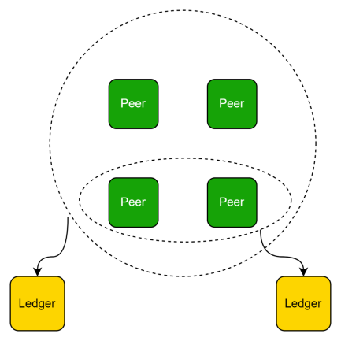
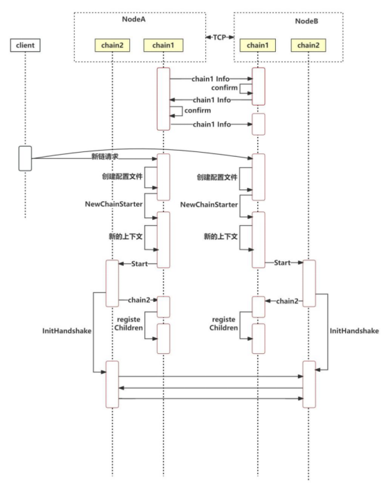
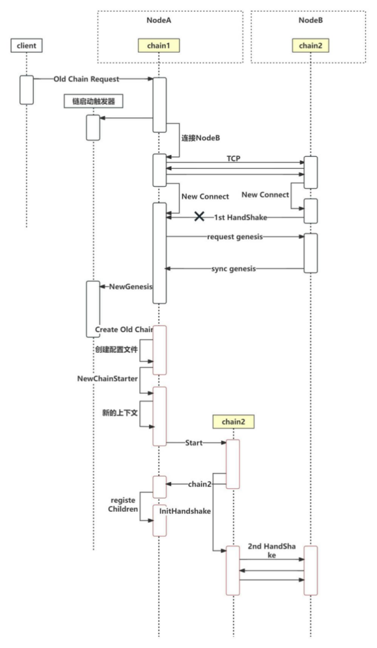
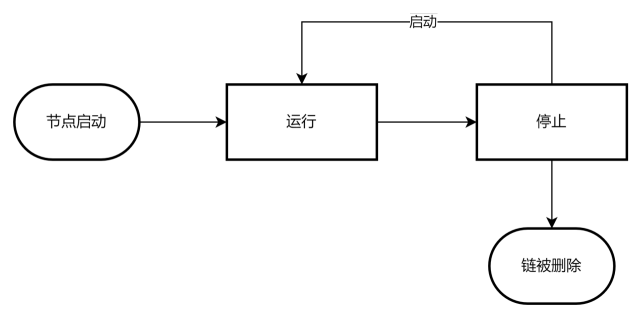

# 以链建链介绍

如果你正在运行一条2.0版本以上的晶格区块链，现有业务产生的数据较多，但与主体业务无关，或需要与其他业务数据隔离。那么你就可以通过**以链建链**新建一个账本来为这类业务提供区块链支持。



# 功能介绍

## 使用说明

通过[附件的合约ABI](#attachmentABI)向你运行的晶格链发起相关交易

以链建链合约提供的服务以及参数说明

|        | ABI        |      |
| ------ | ---------- | ---- |
| 新建链 | newChain   |      |
| 加入链 | oldChain   |      |
| 停止链 | stopChain  |      |
| 启动链 | startChain |      |
| 删除链 | delChain   |      |


## 新建链

发起新建链时的参数如下：

| 参数名               | 类型       | 备注                                            |         |                          | 默认值                  |
| -------------------- | ---------- | ----------------------------------------------- | ------- | ------------------------ | ----------------------- |
| consensus            | uint8      | 0:继承主链1: poa 2:pbft 3:raft 默认             |         | >0                       | 继承主链                |
| tokenless            | bool       | 是否有币                                        |         |                          | 继承主链                |
| godAmount            | uint256    | 盟主初始余额                                    |         |                          | 继承主链                |
| period               | uint64     | 出块间隔，单位：ms                              |         |                          | 继承主链                |
| noEmptyAnchor        | bool       | 不允许快速出空块                                |         |                          | 继承主链                |
| emptyAnchorPeriodMul | uint64     | 空块等待次数                                    |         |                          | 继承主链                |
| isContractVote       | bool       | 开启生命周期                                    |         |                          | 继承主链                |
| isDictatorship       | bool       | 开启盟主独裁                                    |         |                          | 继承主链                |
| deployRule           | uint8      | 合约部署规则                                    |         |                          | 继承主链                |
| name                 | string     | 链名称                                          |         |                          | 主链name\_child\_子链id |
| chainId              | uint256    | 链Id                                            |         |                          | 1000->10001             |
| chainMemberGroup     | Member     | []chainMemberGroup                              | Address | 节点地址                 | 必填                    |
|                      | MemberType |                                                 | uint8   | 0: 见证1：共识           |                         |
| preacher             | Address    | 创世节点地址,不做特殊指定时preacher也是共识节点 |         |                          | 必填                    |
| bootStrap            | string     | 创世节点Inode                                   |         |                          | 不可为空                |
| contractPermission   | bool       | 合约内部管理开关                                |         |                          | 继承主链                |
| chainByChainVote     | uint8      | 以链建链投票开关                                |         |                          | 继承主链                |
| proposalExpireTime   | uint       | 提案过期时间（天）                              |         |                          | 继承主链                |
| desc                 | string     | 链描述                                          |         |                          | 空                      |
| configModifyRule     | uint8      | 链配置更改规则                                  |         | 1: 盟主独裁；2：共识投票 | 继承主链                |

 

建链的时序图（如果有投票，这个过程在投票通过后才出发）：



## 加入链

加入链的参数说明

| 参数名        | 类型      | 备注                           |
| ------------- | --------- | ------------------------------ |
| chainId       | uint      | 需要加入的链ID                 |
| networkId     | uint      | 需要假如的链所在的网络ID       |
| nodeInfo      | string    | 指定一个已经加入该链的节点地址 |
| accessMembers | []address | 指定哪些节点加入该链           |

加入其他链的时序图：



## 停止链

停止的链不能是 `$ConfigsDir`/genesis.json的链

停止链的交易可以发给任意一个正在运行的链 `cbyc_chainStatus`=start

链成功停止后，不会在继续出块，不能再对链做任何写入操作，只能做读取操作。

## 启动链

重新启动已经停止的链。

## 删除链

删除已经停止的链，对正在运行的链发起删除的操作不会执行。

## 链的生命周期



# 附件

## <span id="attachmentContract">以链建链合约</span>

合约地址：zltc_ZDfqCd4ZbBi4WA7uG4cGpFWRyTFqzyHUn

### <span id="attachmentABI"> 合约ABI </span>

```
[
	{
		"inputs": [
			{
				"internalType": "uint256",
				"name": "chainId",
				"type": "uint256"
			}
		],
		"name": "delChain",
		"outputs": [],
		"stateMutability": "nonpayable",
		"type": "function"
	},
	{
		"inputs": [
			{
				"internalType": "string",
				"name": "jsonMap",	
				"type": "string"
			}
		],
		"name": "newChain",
		"outputs": [],
		"stateMutability": "nonpayable",
		"type": "function"
	},
	{
		"inputs": [
			{
				"internalType": "uint256",
				"name": "chainId",
				"type": "uint256"
			},
			{
				"internalType": "uint64",
				"name": "networkId",
				"type": "uint64"
			},
			{
				"internalType": "string",
				"name": "nodeInfo",
				"type": "string"
			},
			{
				"internalType": "address[]",
				"name": "accessMembers",
				"type": "address[]"
			}
		],
		"name": "oldChain",
		"outputs": [],
		"stateMutability": "nonpayable",
		"type": "function"
	},
	{
		"inputs": [
			{
				"internalType": "uint256",
				"name": "chainId",
				"type": "uint256"
			}
		],
		"name": "stopChain",
		"outputs": [],
		"stateMutability": "nonpayable",
		"type": "function"
	},
	{
		"inputs": [
			{
				"internalType": "uint256",
				"name": "chainId",
				"type": "uint256"
			}
		],
		"name": "startChain",
		"outputs": [],
		"stateMutability": "nonpayable",
		"type": "function"
	}
]
```

## 晶格API

### **cbyc_getChildChainId**

#### 获取已有子链的ID

示例

`cbyc17_getChildChainId`, 查询链Id为17的所有子链

``` 
{

  "jsonrpc": "2.0",

  "method": "cbyc17_getChildChainId",

  "params": [ 

  ],

  "id": 1

}
```

### **cbyc_getChainStatus**

#### 获取链运行状态 （running/stop）

```json
{

  "jsonrpc": "2.0",

  "method": "cbyc17_getChainStatus",

  "params": [ 

  ],

  "id": 1

}
```

返回值: running/stop

### cbyc_getCreatedAllChains

#### 获取当前链创建的所有子链

```json
{
    "jsonrpc": "2.0",
    "method": "latc_getProtocols",
    "params": [
    ],
    "id": 1
}
```

### cbyc_selfJoinChain

#### 让当前节点加入某条链

参数：

- 链id
- 网络id
- 已知已经有该链的节点的Inode

```json
{
    "jsonrpc": "2.0",
    "method": "cbyc_selfJoinChain",
    "params": [
        1213,
        12,
        "xxxx"
    ],
    "id": 1
}
```

返回值：成功或错误信息

### cbyc_stopSelfChain

#### 停止当前节点的链服务

```json
{
    "jsonrpc": "2.0",
    "method": "cbyc_stopSelfChain",
    "params": [
    ],
    "id": 1
}
```

返回值：成功或错误信息

### cbyc_startSelfChain

#### 开启当前节点的链服务

```json
{
    "jsonrpc": "2.0",
    "method": "cbyc_startSelfChain",
    "params": [
    ],
    "id": 1
}
```

返回值：成功或错误信息

### cbyc_restartSelfChain

#### 重启当前节点的链服务

```json
{
    "jsonrpc": "2.0",
    "method": "cbyc_restartSelfChain",
    "params": [
    ],
    "id": 1
}
```

返回值：成功或错误信息

### cbyc_delSelfChain

#### 删除当前节点的链服务及数据

> 不能撤销，成功请求后，节点关与此链的链账本会被删除。

```json
{
    "jsonrpc": "2.0",
    "method": "cbyc_delSelfChain",
    "params": [
    ],
    "id": 1
}
```

返回值：成功或错误信息

### node_getAllChainId

#### 返回该节点维护的链ID

``` json
{
    "jsonrpc": "2.0",
    "method": "node_getAllChainId",
    "params": [
    ],
    "id": 1
}
```

### latc_latcInfo

``` json
{
    "jsonrpc": "2.0",
    "method": "latc_latcInfo",
    "params": [
    ],
    "id": 481
}
```

